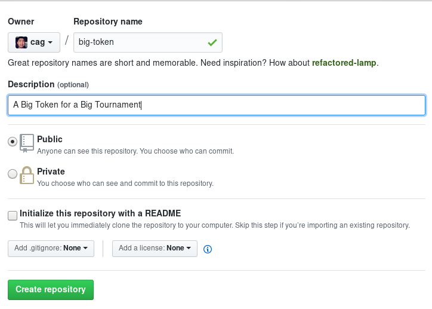

# Smart Contracts

In order to run a fresh tournament, you will need to deploy a set of contracts for the tournament. These contracts can be found at the [`olympia-token` repository](https://github.com/gnosis/olympia-token), or on NPM as `@gnosis.pm/olympia-token`.

You may also wish to configure some parameters for your deployment, or even to modify some things. We will create a new package for these purposes. We will be using NPM for this guide, though it will probably work with EthPM if you adapt it appropriately.

Let's say that we want to name the tournament play token "Big Token." We want to be able to work with this token in Gnosis JS and ultimately in the user interface to the tournament. Let's make and enter a directory called `big-token`, where we will prepare a package:

```sh
mkdir big-token
cd big-token
```

We will unbox a Truffle box called [lil-box](https://github.com/gnosis/lil-box) here:

```sh
truffle unbox gnosis/lil-box
```

Make a Git repo here if desired:

```sh
git init
git add .
git commit -m "Initial commit"
```

You may create a repo on Github if desired:



```sh
git remote add origin git@github.com:cag/big-token.git
git push -u origin master
```

Then let's complete the [NPM](https://www.npmjs.com/) `package.json` setup:

```
$ npm init
This utility will walk you through creating a package.json file.
It only covers the most common items, and tries to guess sensible defaults.

See `npm help json` for definitive documentation on these fields
and exactly what they do.

Use `npm install <pkg>` afterwards to install a package and
save it as a dependency in the package.json file.

Press ^C at any time to quit.
package name: (big-token) 
...
entry point: (.eslintrc.js) index.js
...
```

Be sure to specify `index.js` as the entry point.

Install `@gnosis.pm/olympia-token` as a dependency:

```sh
npm i @gnosis.pm/olympia-token
```

Then create a contract in `contracts/` called `BigToken.sol`:

```sol
pragma solidity ^0.4.21;

import "@gnosis.pm/olympia-token/contracts/PlayToken.sol";

contract BigToken is PlayToken {
    string public constant name = "Big Token";
    string public constant symbol = "BIG";
    uint8 public constant decimals = 18;
}

import "@gnosis.pm/olympia-token/contracts/AddressRegistry.sol";
```

In our example, we are keeping the functionality of the [PlayToken](https://github.com/gnosis/olympia-token) the same, but you are free to modify the token however you'd like. Also note that we set the `name`, `symbol` and `decimal` fields which are optional [ERC20](https://theethereum.wiki/w/index.php/ERC20_Token_Standard) fields, but also highly recommended for correct interoperability with the frontend. Finally, make sure to set the `decimal` field to 18, matching the format of ether.

We also import the [AddressRegistry](https://github.com/gnosis/olympia-token) so that we can deploy our own copy of that registry for our users.

Try compiling the file:

```
$ npm run truffle compile

> big-token@2.0.0 truffle /path/to/big-token
> truffle "compile"

Compiling ./contracts/BigToken.sol...

[Some more stuff...]

Writing artifacts to ./build/contracts
```

We have two build artifacts in `./build/contracts` in which we are currently interested: `BigToken.json` and `AddressRegistry.json`. We need the contracts these correspond with to be deployed, and we need these artifacts to contain that deployment information. First, we create a migration script to deploy these contracts in the `migrations` folder as `2_deploy_contracts.js`:

```js
module.exports = function(deployer) {
  ["BigToken", "AddressRegistry"].forEach(c =>
    deployer.deploy(artifacts.require(c))
  );
};
```

This will cause Truffle to deploy these contracts as part of its migration process. Try this deployment out in the Truffle development environment:

```
$ npm run truffle develop

[Truffle does some setup and opens a command line. You will want to run 'migrate' in the shell:]

truffle(develop)> migrate
Using network 'develop'.

Running migration: 1_initial_migration.js
  Deploying Migrations...
  ... 0xeba4f9cc757161d91adce5cf4aaed5441b49beac76f994470da6920d54877c4a
  Migrations: 0x8cdaf0cd259887258bc13a92c0a6da92698644c0
Saving successful migration to network...
  ... 0xd7bc86d31bee32fa3988f1c1eabce403a1b5d570340a3a9cdba53a472ee8c956
Saving artifacts...
Running migration: 2_deploy_contracts.js
  Deploying BigToken...
  ... 0x473828664dd2dba56bd5e789e20b300ad3a2a295b43dd62c026d2141572cbcd1
  BigToken: 0x345ca3e014aaf5dca488057592ee47305d9b3e10
  Deploying AddressRegistry...
  ... 0xd7edc0e525eda0641b157c4b7fb4bf5b1338d44207c3900934e8307d777c276d
  AddressRegistry: 0xf25186b5081ff5ce73482ad761db0eb0d25abfbf
Saving successful migration to network...
  ... 0x059cf1bbc372b9348ce487de910358801bbbd1c89182853439bec0afaee6c7db
Saving artifacts...
truffle(develop)> 
```

If you've done this before, `migrate` might fail. In that case, try `migrate --reset` instead. Also, after running that command, you can see that there is deployment information about the test migration recorded in the artifacts:

```
$ npm run truffle networks

> big-token@2.0.0 truffle /path/to/big-token
> truffle "networks"


Network: UNKNOWN (id: 4447)
  AddressRegistry: 0xf25186b5081ff5ce73482ad761db0eb0d25abfbf
  BigToken: 0x345ca3e014aaf5dca488057592ee47305d9b3e10
  Migrations: 0x8cdaf0cd259887258bc13a92c0a6da92698644c0
```

If that worked, we're ready to deploy this on a public test network. Follow [this guide](https://gnosis.github.io/lil-box/deployment-guide.html) to do so.

And finally, let's ship it!

```text
$ npm publish
```

(By the way, `big-token` is taken, so find your own name ;)
