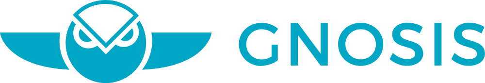

Gnosis Apollo is a collection of packages that allows anyone to roll your own *Gnosis Prediction Market Interface* or *Gnosis Olympia*.

It consists of the `pm-contracts`, `pm-js`, `pm-trading-db` and `pm-trading-ui`. 

Gnosis Apollo
-----------------------

.. toctree::
    :maxdepth: 0
    :caption: Documents
    
    Introduction <self>
    getting-started
    prediction-markets-as-modular-framework

.. toctree::
    :maxdepth: 3
    :caption: Create Prediction Markets

    pm-scripts

.. toctree::
    :maxdepth: 0
    :caption: Javascript/Node.js library

    pm-js
    pm-js-usage
    pm-js-notes
    lmsr

.. toctree::
    :maxdepth: 3
    :caption: PM Trading DB (Ethereum Indexer)

    pm-trading-db

.. toctree::
    :maxdepth: 3
    :caption: PM Trading UI

    pm-trading-ui
    pm-trading-ui-rewards

.. * :ref:`genindex`
.. * :ref:`modindex`
.. * :ref:`search`

Related Github projects
----------------------------
* **Smart contracts**: https://github.com/gnosis/pm-contracts
* **Javascript library**: https://github.com/gnosis/pm-js
* **Prediction Markets Interface**: https://github.com/gnosis/pm-trading-ui
* **Database Indexer**: https://github.com/gnosis/pm-trading-db
* **Tournament Smart Contracts**: https://github.com/gnosis/pm-apollo-contracts
