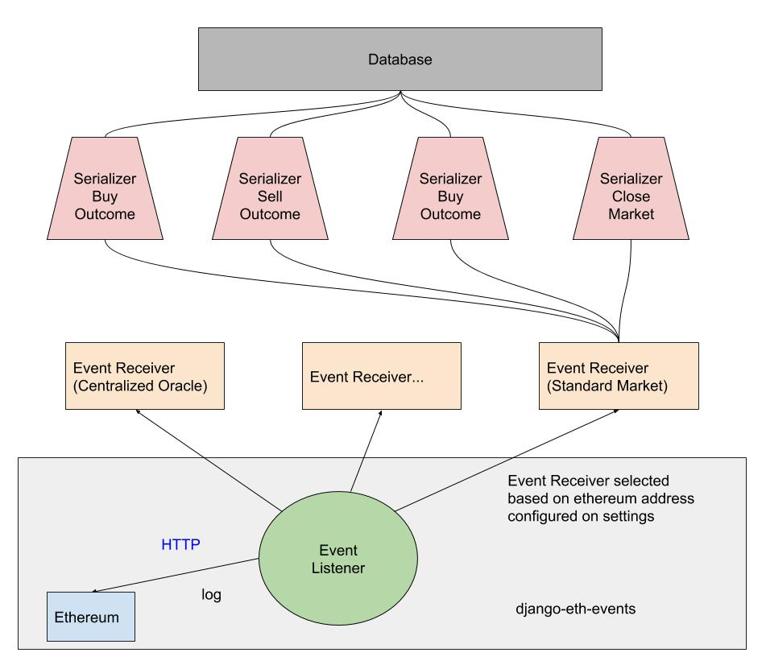

# Prediction markets as a modular framework
Our modular framework aims to provide the foundational protocol upon which projects using prediction markets can grow. 
In this section we describe the different layers that compose the prediction markets framework.

## Trading UI
The generic interface to interact with prediction markets is trading-ui, a javascript project built with React that you can use as starting point to adapt it for [your particular use case](https://blog.gnosis.pm/the-power-of-prediction-markets-fedea0b71244) 

## Ethereum Indexer
Discovering data in ethereum is complex or potentially even impossible depending on the use case.
The "standard way" to query bulk data in ethereum is through [filters](https://github.com/ethereum/wiki/wiki/JavaScript-API#web3ethfilter) this is very convenient for discovering ERC20 tx's during a certain period, or the creation of a Multisig contract through a certain factory, but imagine you want something more complex. For instance, what if you wanted to obtain all markets created by a certain ethereum address that use a specific token.
To get this information, you will need to get all [MarketCreation events](https://github.com/gnosis/pm-contracts/blob/v1.1.0/contracts/Markets/StandardMarketFactory.sol#L27) and then query all the relations: Market -> Event -> Oracle -> IPFS

In practice this is `O(n^4)` and with many P2P network connections, it might work with a few values. But as soon as you create markets, it will be unusable.

For this reason we have created an Ethereum Indexer called TradingDB. It's a micro-service Python project that queries ethereum nodes and allows powerful queries to be run in milliseconds.

This is the basic architecture:

## Javascript Library
If you want to go deeper and integrate with the ethereum blockchain, our javascript library `pm-js` is the middleware between the Smart Contracts and your program. It abstracts away some of the logic related to prediction markets and adds some useful features like validation.

You can directly use the contracts with web3, and it could be more intuitive for you but will be harder to perform buy and sell operations. Also, web3 won't validate your parameters. So it is important to exercise caution with the values you use or there will be many failing transactions.

## Smart Contracts
The Smart Contracts are designed in a modular manner in order to make it easy to integrate with different Ethereum projects and extend their functionality. For example, you could use Gnosis Smart Contracts for all trading functionalities and use Augur as an Oracle by extending the Oracle interface and build a [Smart Contract Adapter](https://en.wikipedia.org/wiki/Adapter_pattern).

The main components are described in [this blog post](https://blog.gnosis.pm/getting-to-the-core-4db11a31c35f).

