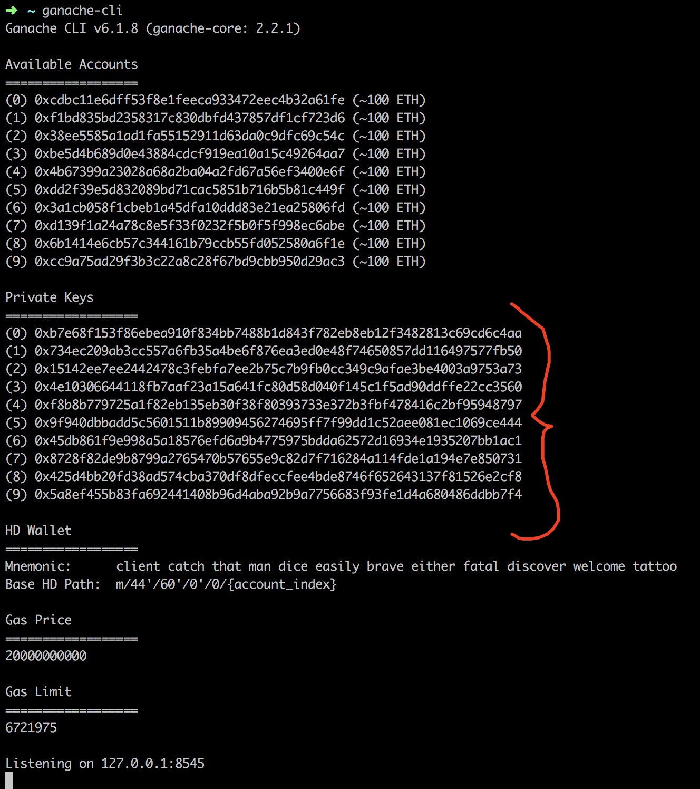

# Tournament Operator Guide
We assume, you have read past sections, and you already know how to operate a Gnosis prediction market platform: create markets, set up tradingdb, host the website and resolve the markets.
In this section we will explain step by steps what do you need in order to configure your own Prediction Markets Tournament.

# Set up contracts
## Create Ethereum Accounts
First of all, we need you to generate at least 2 accounts. Why two? because we need 1 account to issue tokens and other to create markets, and it might happen in parallel, so we need to separate the accounts to avoid nonce collision.
```sh
# In case you don't have ganache-cli. This is the main local testnet tool used for ethereum development. By default it creates random private keys and a Mnemonic, that's perfect for creating new accounts in bulk.

npm install -g 'ganache-cli'
ganache-cli
```

By executing this command, you get 10 accounts created, derived by a random mnemonic phrase and all it's related private keys, as you can see in the picture.


## Tournament Contracts
Download the 
```sh
git clone https://github.com/gnosis/pm-apollo-contracts.git
```

Usually you would like to rename the contract from 'OLY' to something related with your project. For that end you just need to change two lines:  

* [token name](https://github.com/gnosis/pm-apollo-contracts/blob/v1.4.1/contracts/OlympiaToken.sol#L9) 

* [token symbol](https://github.com/gnosis/pm-apollo-contracts/blob/v1.4.1/contracts/OlympiaToken.sol#L9)

You can also change the file itself, if you want for example to look with a different names when validating the contract on etherscan, but it's not necessary.

**In case you want to modify deeper the tournament token, the requirements are: It should be ERC20 compliant and also implement the issue function (if you want to use automatic issuance for new users)**

### Deploy
Set up your private key or mnemonic:
```sh
export MNEMONIC='client catch that man dice easily brave either fatal discover welcome tattoo'
# or export PRIVATEKEY='0xb7e68f153f86ebea910f834bb7488b1d843f782eb8eb12f3482813c69cd6c4aa'
```

Install dependencies and execute migration:
```sh
npm run migrate -- --network=rinkeby
# If you want to run it again, you need to add the option --reset
```

This command will deploy 3 contracts:
* `Truffle migration contract`. Keeps track of the different migrations, in case we add a new step, will go from the last point. Will not reset all the contracts.
* `Tournament Token`. It's the ERC20 token used by the tournament markets and users.
* `Address Registry`. It's the contract the users need to register to, in oder to appear in the scoreboard and also get tournament tokens (in case you set up auto-issuance).

### Validate Contracts
This step is completely optional, but it's a recommended practice, so you are transparent with your users about what the tournament contracts do.

Execute the command: 
```sh
npx truffle-flattener contracts/OlympiaToken.sol > ValidateToken.sol
npx truffle-flattener contracts/AddressRegistry.sol > ValidateRegistry.sol
```

So, now you should go to etherscan and validate both contracts, in the url `https://rinkeby.etherscan.io/verifyContract2?a=<address>`

being `<address>` the contract address, you can check those with:
```sh
npx truffle -- networks
```

You need to enter:
1. Contract Name: OlympiaToken or Address Registry
2. Compiler 0.4.23 commit (you can check it with `npx truffle version`)
3. Optimization off
4. Code, the content of `ValidateToken.sol` and `ValidateRegistry.sol` respectively.

### Configure Contracts.

Previously we created a bunch of ethereum accounts to separate nonce of the issuer and market creator and isolate roles. For that end we need to execute 2 transactions through the command line in the pm-contracts project.

```sh
export CREATOR_ADDRESS=<address>
npm run add-admins -- --addresses=$CREATOR_ADDRESS --network=rinkeby
npm run issue-tokens -- --amount 1000e18 --to $CREATOR_ADDRESS --network=rinkeby
```

**Note we issued 1000 Tournament tokens, it's in scientific notation. Represents 1000 units with 18 decimals (the default value for decimals)**

## Deploy Markets with pm-scripts
We assume you already take a look at [pm-scripts section](/pm-scripts) and understand the usage of the tool. In order to deploy tournament markets you need to modify one more parameter in the `config.json`:
```javascript
"collateralToken": "<address>" # This is the Tournament Token Contract deployed before.
```

And also, as you are using a new account that has admin rights over the token, you need to set up that account in the `config.json`.